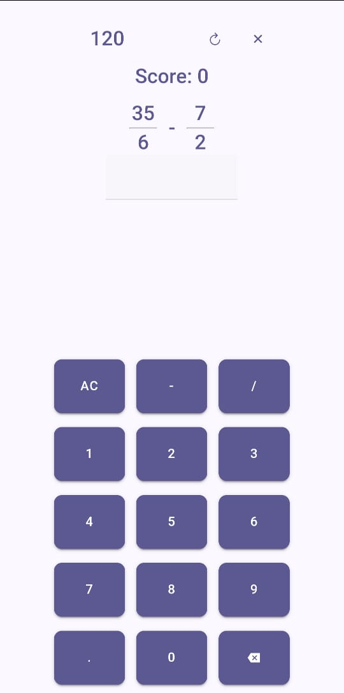
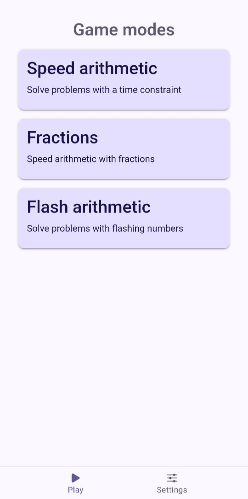
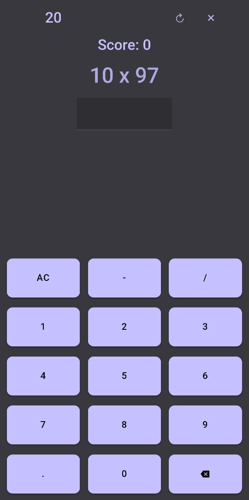
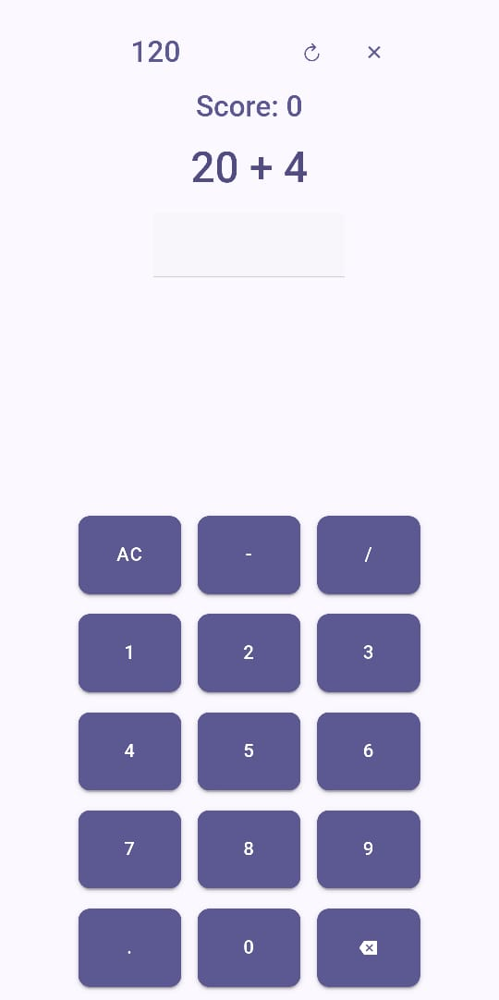

# Fastmath

Game for practicing mental arithmetic, made with ionic/vue and capacitor, currently has three gamemodes: speed arithmetic similar to zetamac with more options, fractions and flash arithmetic similar to flash anzan. Light or dark mode according to device preferences.

## How to run

If you are on android check the releases tab on the sidebar, there you will find an apk you can download and install.

   
